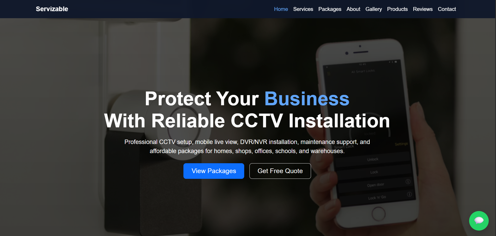
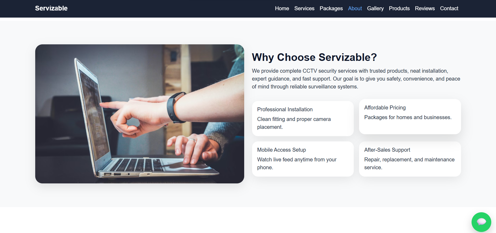
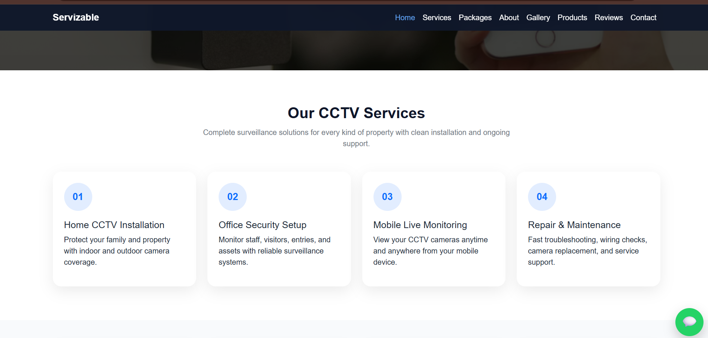
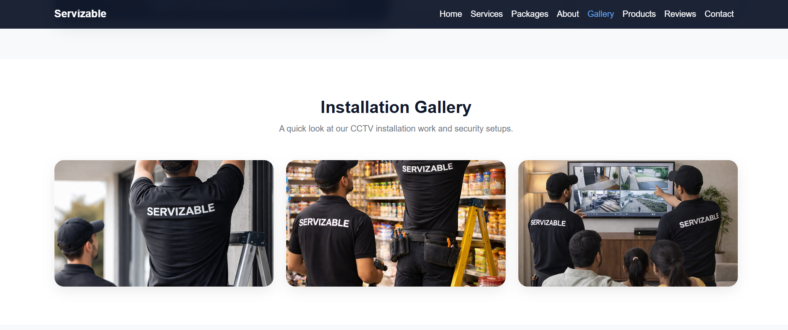
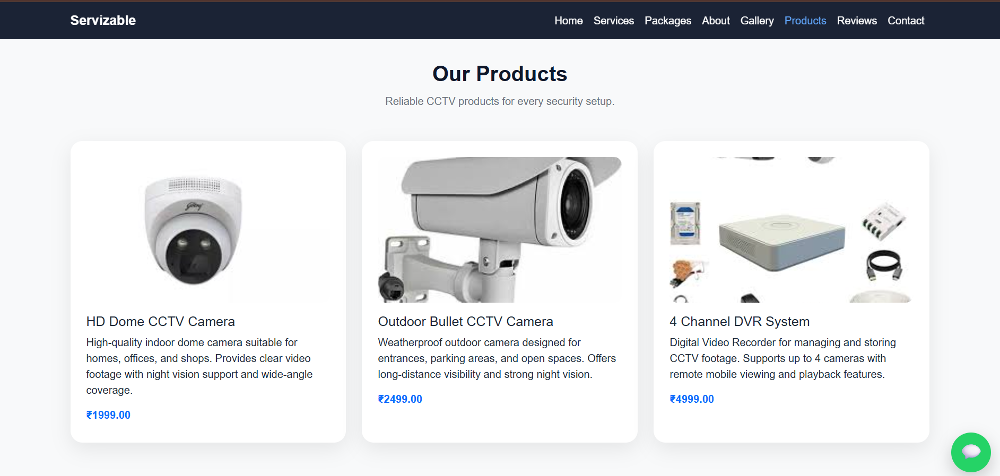
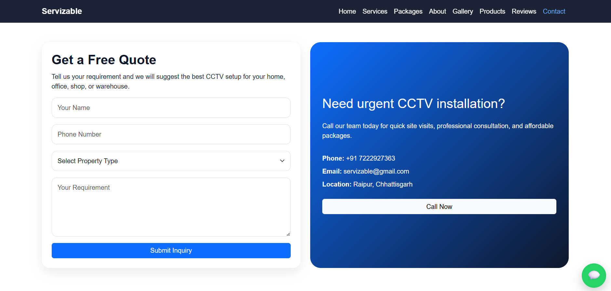

<h1 align="center">🎥 CCTV Services Website</h1>

<p align="center">
  <b>A Full Stack Django Project for Security Services Business</b>
</p>

<p align="center">
  
  
  
  
  
  
</p>

---

## 📌 About The Project

This is a **full-stack CCTV services business website** built using **Django**.

The project is designed for a real-world security services company to showcase:
- CCTV installation services
- Product offerings
- Business information
- Customer inquiries

It includes a **modern responsive UI** and a **powerful Django backend** for managing content dynamically.

---

## ✨ Key Features

✔️ Fully responsive design (Mobile + Desktop)  
✔️ Professional business homepage UI  
✔️ Services and product showcase  
✔️ Customer inquiry/contact form  
✔️ Dynamic product management using Django  
✔️ Image upload & media handling  
✔️ Django Admin Panel for full control  
✔️ Database integration (SQLite)  

---

## 🛠️ Tech Stack

### 💻 Frontend
- HTML5  
- CSS3  
- Bootstrap 5  
- JavaScript  

### ⚙️ Backend
- Django  

### 🗄️ Database
- SQLite3  

### ☁️ Media Handling
- Cloudinary  

---

## 📷 Screenshots

<p align="center">
  
</p>

<p align="center">
  
</p>

<p align="center">
  
</p>

<p align="center">
  
</p>

<p align="center">
  
</p>

<p align="center">
  
</p>

---

## 🚀 Live Demo
[Click here to view project](https://cctv-services-website.onrender.com)

## 📁 Project Structure

```bash
cctv-services-website/
│
├── cctv_project/
├── main/
├── templates/
├── static/
│   ├── css/
│   ├── js/
│   └── images/
├── media/
├── db.sqlite3
├── manage.py
└── requirements.txt


---

## ⚙️ How It Works

### 👤 User Side
- Visit the website  
- View services and CCTV products  
- Explore gallery and business information  
- Submit inquiry through contact form  

### 🛠️ Admin Side
- Add, update, and delete products  
- Upload and manage product images  
- View and manage customer inquiries  
- Control website content via Django Admin  

---

---

## ▶️ Run Locally

```bash
git clone https://github.com/Rinkykumari05/cctv-services-website.git
cd cctv-services-website

pip install -r requirements.txt
python manage.py migrate
python manage.py runserver
